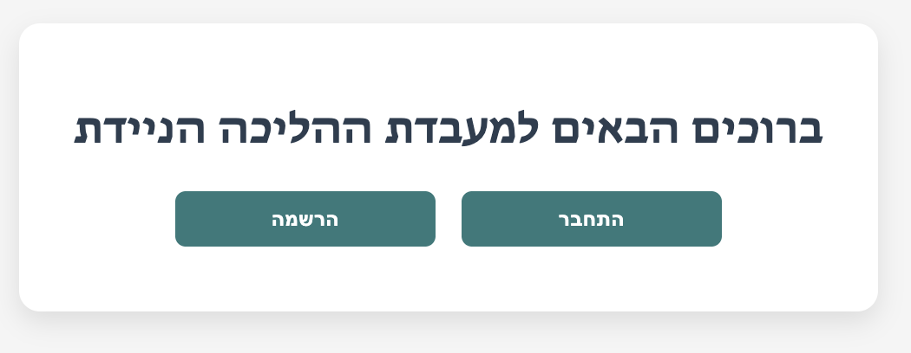
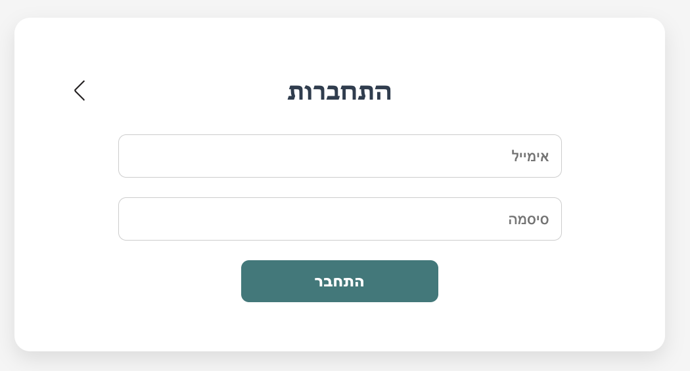
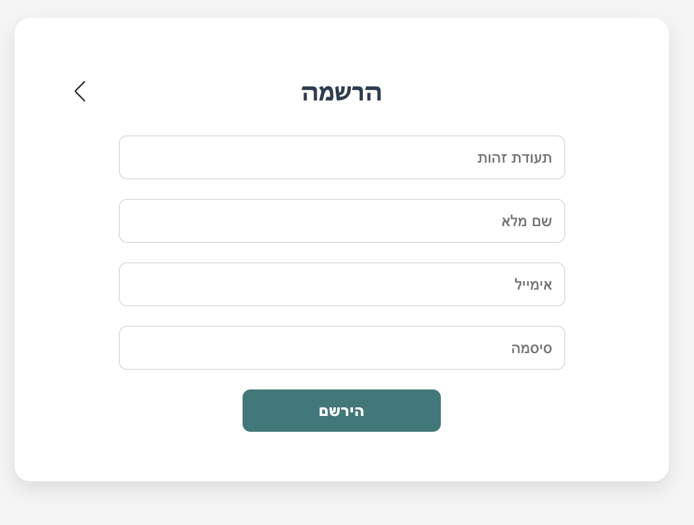
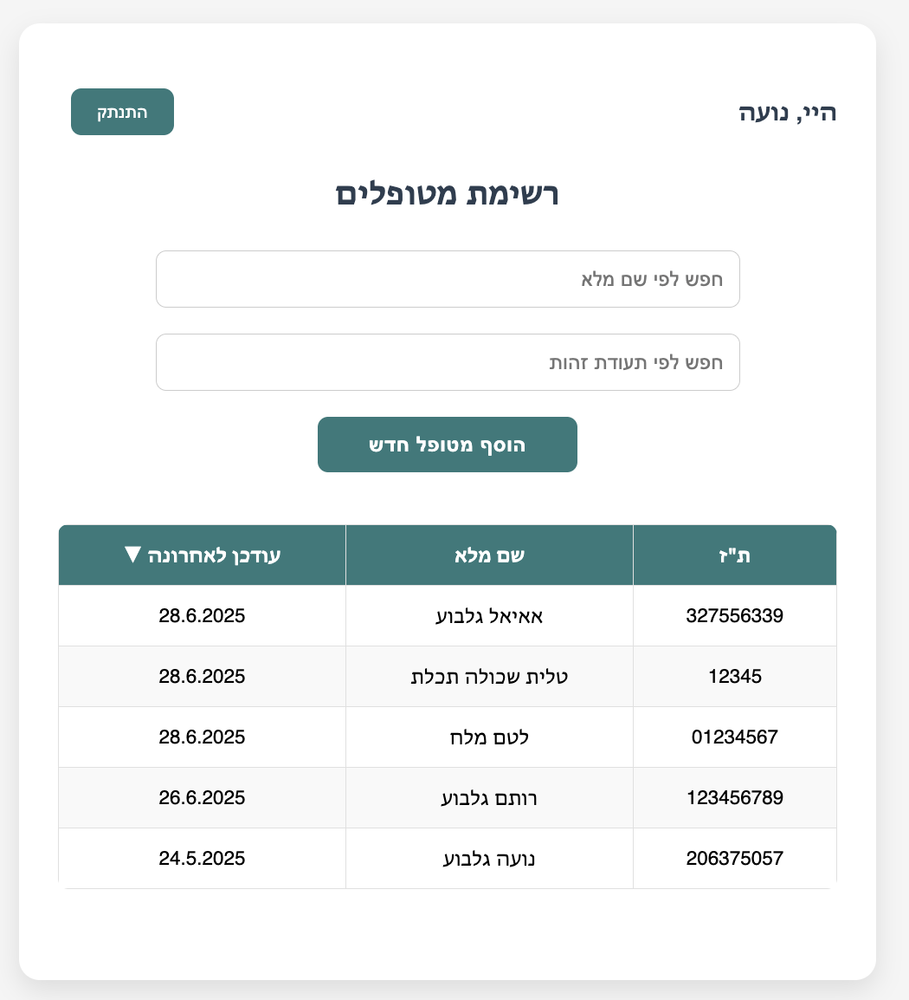
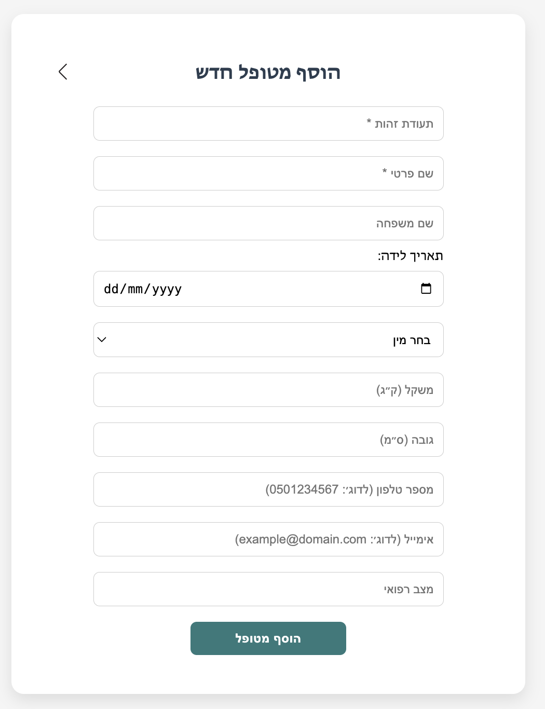
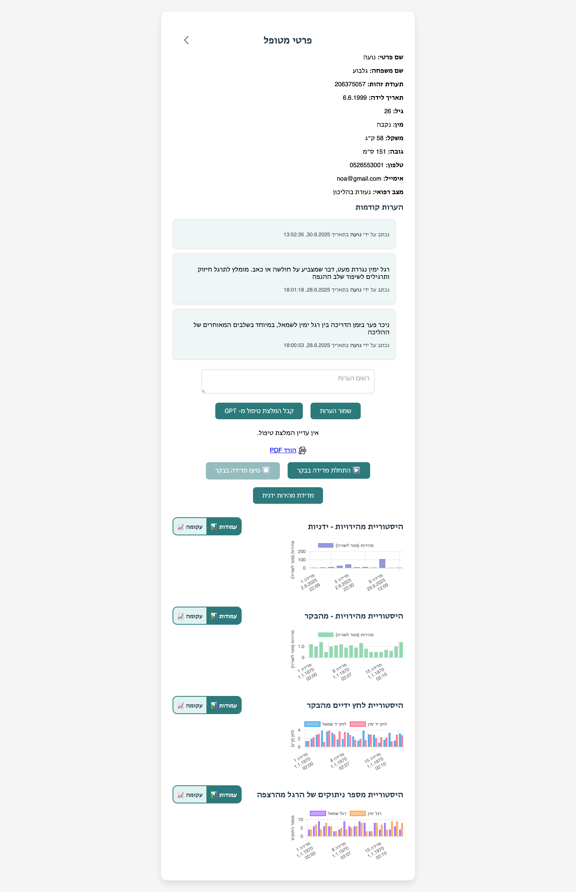
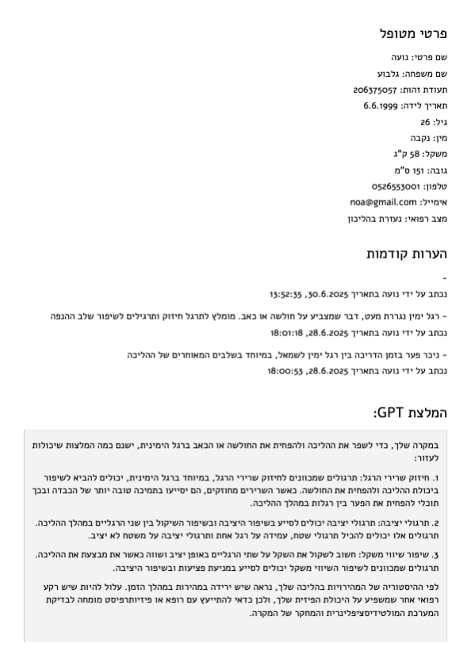
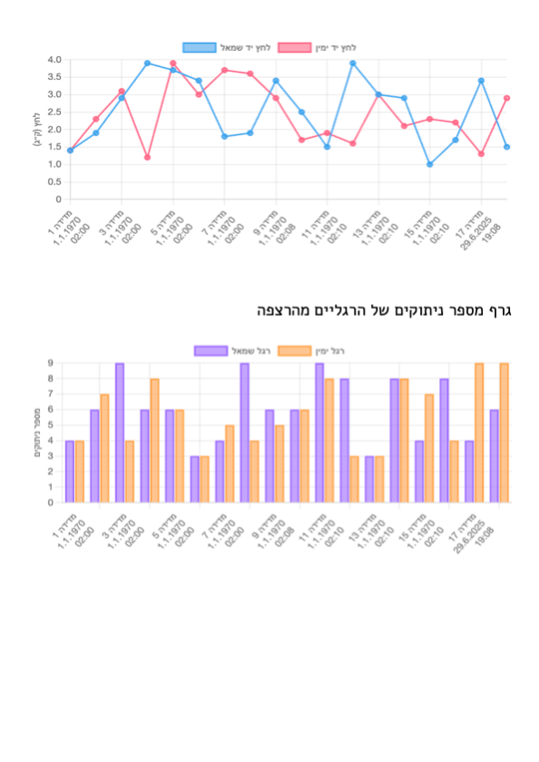

# Mobile Walking Lab – Client

This is the **React-based frontend** for the Mobile Walking Lab project. It serves as the main interface for physiotherapists to manage patient data, monitor walking measurements collected from an ESP32-based device, and generate AI-powered treatment recommendations.


## 🚀 Features

* ✅ **Therapist login and registration**
  Therapists can sign up, log in, and securely manage patient records.

* 🧑‍⚕️ **Patient management**

  * View and manage patient profiles.
  * Add new patients with detailed information.

* 🔍 **Patient list with advanced search and sort**

  * Search patients by **first name**, **last name**, or **ID number**.
  * Sort the list by **update date**, **name**, or **ID** for easier access.

* 📝 **Notes management**

  * Add textual notes for each patient.
  * View full note history with timestamp and author.

* 📈 **Charts and walking measurements**

  * **Manual Speed Chart** – calculate walking speed manually using time and distance.
  * **ESP32 Speed Chart** – visualize speed from automatic sensor measurements.
  * **Foot Lift Detection** – count the number of times each foot lifts off the ground.
  * **Hand Pressure Data** – display the pressure exerted by each hand on the treadmill.

* 🧠 **GPT-based treatment recommendations**

  * Generate a personalized treatment recommendation using OpenAI.
  * View and edit the recommendation before saving it to the record.

* 📄 **PDF Export**

  * Export the patient's data into a **styled PDF report** that includes:

    * Patient details
    * Historical notes
    * GPT treatment recommendation
    * All available charts with labeled images

* 🧪 **ESP32 Integration**

  * Start and stop measurements directly from the UI.
  * Automatically pull and visualize sensor data including speed, pressure, and foot lifts.

* 📱 **Responsive Design**

  * Optimized layout for desktop, tablet, and mobile views.


## 🗂 Project Structure

```

src/
├── api/
│   ├── apiConfig.js
│   ├── deviceApi.js
│   ├── patientApi.js
│   └── theraistApi.js
│
├── components/
│   ├── charts/
│   │   ├── SpeedChart.js
│   │   ├── PressureChart.js
│   │   ├── FootLiftChart.js
│   │   └── ToggleSwitch.js
│   │
│   ├── AddPatientPage.js
│   ├── LandingPage.js
│   ├── LoginPage.js
│   ├── RegisterPage.js
│   ├── PatientListPage.js
│   ├── PatientDetailsPage.js
│   └── PatientDetailsPDFExport.js
│
├── utils/
│   ├── formatUtils.js
│   └── PatientPdfDocument.js
│
├── app.js
├── index.css
└── index.js

public/
├── fonts/
│   └── Alef-Regular.ttf
├── images/
│   └── [icons, logos, etc...]
└── index.html

````

## 🔧 Installation

```bash
git clone https://github.com/NoaGilboa/Mobile-Walking-Lab.git
cd Mobile-Walking-Lab/client
npm install
npm start
````

The app will run locally at `http://localhost:3000`.

## 🌐 API Base URL

Configured in `apiConfig.js`:

```js
export const BASE_URL = "https://walkinglab-hbesf8g3aaa8hafz.westeurope-01.azurewebsites.net/api";
```

## 📦 Dependencies

* React
* React Router
* Chart.js & react-chartjs-2
* jsPDF & html2canvas (legacy export option)
* @react-pdf/renderer (for structured PDF reports)
* Custom fonts and RTL support for Hebrew

## 📤 PDF Export

* Uses `ref.current.toBase64Image()` to export Chart.js graphs as images.
* The PDF includes patient info, notes, GPT recommendations, and all graphs.
* Hebrew font (`Alef-Regular.ttf`) is embedded via `@react-pdf/renderer`.

## 📱 Mobile-Friendly

The app is styled responsively and compatible with desktop, tablet, and mobile devices.

## 🧠 Recommendation System

GPT treatment recommendations are generated via a backend call to OpenAI’s API. Therapists can view and edit them before saving.

## 📸 Screenshots

### Main Screens







### Patient Dashboard


 


### 🧾 Exported PDF Example
> Exported as PDF: `patient_206375057_details.pdf`




## 👩‍💻 Developer

Developed by [Noa Gilboa](https://github.com/NoaGilboa)


